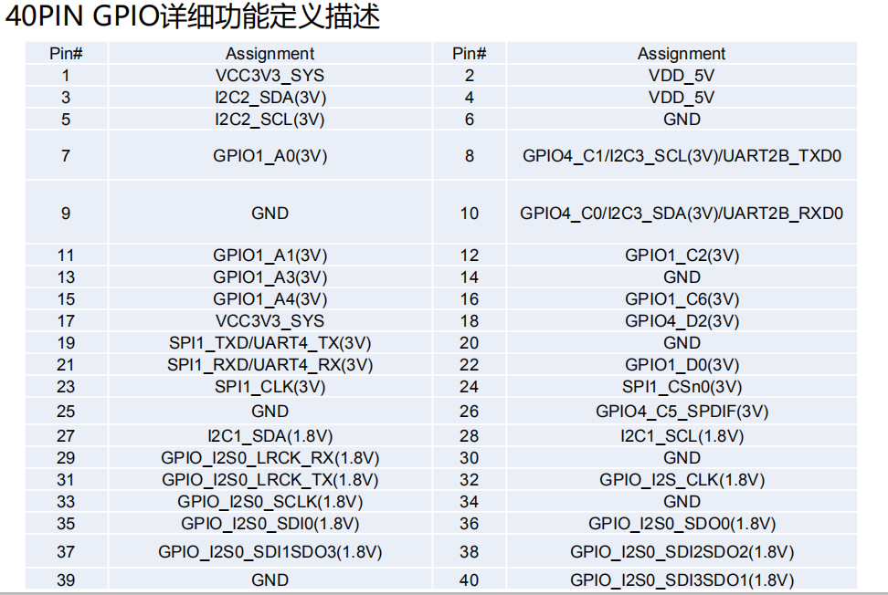

# wiringpi_forLeezPiRK3399
This is wiringpi for LeezPi RK3399 Borad!
## LeeZPi硬件原理图


## 针脚定义


```

 +------+-----+----------+------+   LeezPi-RK3399  +------+----------+-----+------+
 | GPIO | wPi |   Name   | Mode | V | Physical | V | Mode |   Name   | wPi | GPIO |
 +------+-----+----------+------+---+----++----+---+------+----------+-----+------+
 |      |     |     3.3V |      |   |  1 || 2  |   |      | 5V       |     |      |
 |      |     | I2C2_SDA |      |   |  3 || 4  |   |      | 5V       |     |      |
 |      |     | I2C2_SCL |      |   |  5 || 6  |   |      | GND(0V)  |     |      |
 |   32 |   7 | GPIO1_A0 |  OUT | 0 |  7 || 8  |   | ALT  | GPIO4_C1 | 15  |  145 |
 |      |     |  GND(0V) |      |   |  9 || 10 |   | ALT  | GPIO4_C0 | 16  |  144 |
 |   33 |   0 | GPIO1_A1 |   IN | 0 | 11 || 12 | 1 | IN   | GPIO1_C2 | 1   |  50  |
 |   35 |   2 | GPIO1_A3 |   IN | 0 | 13 || 14 |   |      | GND(0V)  |     |      |
 |   36 |   3 | GPIO1_A4 |   IN | 0 | 15 || 16 | 0 | IN   | GPIO1_C6 | 4   |  54  |
 |      |     |     3.3V |      |   | 17 || 18 | 0 | IN   | GPIO1_C7 | 5   |  55  |
 |      |     | UART4_TX |      |   | 19 || 20 |   |      | GND(0V)  |     |      |
 |      |     | UART4_RX |      |   | 21 || 22 | 0 | IN   | GPIO1_D0 | 6   |  56  |
 |      |     | SPI1_CLK |      |   | 23 || 24 |   |      | SPI1_CSn |     |      |
 |      |     |  GND(0V) |      |   | 25 || 26 |   | ALT  | GPIO4_C5 | 11  |  149 |
 |      |     | I2C2_SDA |      |   | 27 || 28 |   |      | I2C2_SCL |     |      |
 |      |     | I2S0_LRX |      |   | 29 || 30 |   |      | GND(0V)  |     |      |
 |      |     | I2S0_LTX |      |   | 31 || 32 |   |      | I2S_CLK  |     |      |
 |      |     | I2S0_SCL |      |   | 33 || 34 |   |      | GND(0V)  |     |      |
 |      |     | I2S0SDI0 |      |   | 35 || 36 |   |      | I2S0SDO0 |     |      |
 |      |     | I2S0I1O3 |      |   | 37 || 38 |   |      | I2S0I2O2 |     |      |
 |      |     |  GND(0V) |      |   | 39 || 40 |   |      | I2S0I3O1 |     |      |
 +------+-----+----------+------+---+----++----+---+------+----------+-----+------+
 
 ```
 
## wiringPi安装
 
  
## wiringPi示例
 
* C语言示例
创建一个C源文件：

```
vi test.c
```

然后键入如下代码:
```
#include <wiringPi.h>
int main(void)
{
  wiringPiSetup() ;
  pinMode (7, OUTPUT) ;
  for(;;)
  {
    digitalWrite(7, HIGH) ;
    delay (500) ;
    digitalWrite(7,  LOW) ;
    delay (500) ;
  }
}
```
编译test.c并运行：
```
gcc -Wall -o test test.c -lwiringPi -lwiringPiDev -lpthread -lrt -lm -lcrypt
sudo ./test
```
看到LED灯一闪一闪的，就表示成功了。
